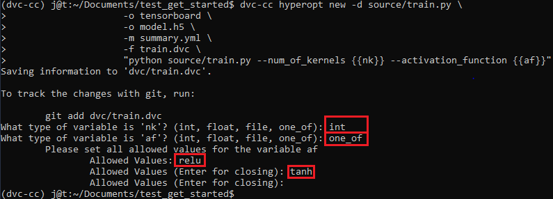

# Get Started with 
At this site, you find a basic tutorial on how to use DVC-CC.
This tutorial is intended to be as simple as possible

DVC-CC has many more features than described in this tutorial. To find out more about these features, check out the 
additional tutorials at the "**Even more**" clues.
If you want to learn more about the technical description of what happens when using DVC-CC, take a look at the 
"**Behind the scenes**" clues.

After this tutorial, you should be able to know the basic command that you need to work with DVC-CC and adapt this to 
your project.

> **Even more**: [Here](_get_started_only_commands.md), you find only the commands of this tutorial **without text**. ;)

## 1) Create an empty GIT-Repository

GIT is well known in software development and has proven itself in practice.
But not all concepts from software development can be transferred to machine learning tasks:

> "Developing a machine learning application is even more iterative and explorative process than software engineering."
[by Futurice.com](https://www.futurice.com/blog/differences-between-machine-learning-and-software-engineering/)

In machine learning, we are dealing with large data sets and models.
We have to deal with a lot of experiments and make sure that we can always jump back and forth between them. We also 
need to remember which hyperparameters were used in each experiment.

The software DVC, on which DVC-CC is based, is very closely connected to GIT. It works like an extension to GIT 
for machine learning projects.

Your first task is now to
- create an empty [GitHub](https://github.com/) or [GitLab](https://gitlab.com/) repository,
- open a console,
- (activate your DVC-CC anaconda environment,)
- pull the empty git repository and
- change the directory to your git project. 

## 2) Generate source code
Now we need some source code that does some task. This can be anything that can be called from the console 
(python script, shell script, ...).
To get the most out of DVC-CC, you should write a source code that has *input* files/parameters and generates *output*
 files.

For this tutorial, you can download source code to train a Convolutional Neural Network (CNN) in TensorFlow:

```bash
mkdir source
wget -O source/train.py https://bit.ly/2krHi8E
```

The following graphic shows the *input* parameters and the *output* files/folders of the script from above:


Here one of the outputs is a metric file. A metric file is a special type of output that can summaries the result of 
the script. Typically this is a JSON file that includes the necessary numbers to compare different models (numbers 
like best train/validation accuracy, the smallest train/validation loss, ...).

## 3) Init DVC-CC
Before you start to work with DVC-CC, you need to configure it for this project. You can do this with:

```bash
dvc-cc init
```

This command will ask you to set all necessary parameters to work on your cluster. To change the settings you can 
rerun the `dvc-cc init` command.

If you have access to the deep.TEACHING cluster you can leave everything to the default values, except

- the number of  GPUs, set this to 1, and
- the username, set this to your matriculation number s0XXXXXX.

> **Even more**: On [this site](_settings.md), you can find all the information about the settings of DVC-CC.

<blockquote><b>Behind the scenes</b>: <details><summary>What happens if you call "dvc-cc init"?</summary>
<p>

The first step of DVC-CC is to ask you for the necessary parameters. If you abort during this (with CTRL+C), nothing 
will happen. After setting the parameters, it calls "dvc init" if this is not yet a DVC-git repository.
It describes the remote connection to the DVC server in the dvc/config-file and creates the remote DVC folder at
the DVC storage server. Finally, all settings for curious containers gets saved in the RED format in the
file .dvc_cc/cc_config.yml.
</p>
</details>
</blockquote>


## 4) Build the DVC-CC hyperopt-file

<blockquote><b>Even more</b>: <details><summary>Why do we need to define a pipeline?</summary>
<p>

To understand it lets take a look at the workflow **without DVC-CC**: We would call the script multiple times with 
different parameters to get multiple 
results and compare these Hyperparameters. I.e.:

- call: "python source/train.py --num-of-kernels 32"
- call: "python source/train.py --num-of-kernels 64"
- ...

These proceeds have multiple problems that need to be solved:
1. You need to make sure that the output of your script gets not overwritten and make the name memorable.
    - How do you make clear which parameters and input files you used?
    - What if you want to run it multiple times?
    - How do you make clear, how the source code looked as the output files were created?
2. If you want to run your script in parallel and not start one job at a time, you need to manage your hardware. This includes making sure that a job gets started if enough resources are free.

DVC-CC uses the software [Data Version Control (DVC)](https://dvc.org/) and [Curious Containers (CC)](https://www.curious-containers.cc/). **DVC** can handle all problems that are described at the first point. It describes the processing pipeline and saving checksums to each dependency/output file, to make sure that the pipeline is unchanged. **CC** is infrastructure software to which you can send docker jobs. CC will make sure to send the jobs to the right hardware to the right time. The job of **DVC-CC** is to use and prepare the defined pipelines of DVC so that CC can run the jobs in the cluster. CC uses a docker where the [DVC-CC-Agent](https://github.com/deep-projects/dvc-cc/tree/master/dvc-cc-agent) software is installed, which downloads the GIT/DVC project, executes the pipeline and sent the results to GIT/DVC storage.

We can summarize as follows: DVC-CC is a wrapper on DVC that makes it easy to integrate it into CC to solve both problems from above.

</p>
</details>
</blockquote>

In the next step, we define the processing pipeline that describes what needs to be called. For this, we use the DVC-CC syntax,
which has just minor changes to the DVC syntax. These minor changes make it possible to create hyperparameters.
With the following command, we define one stage from the pipeline.

```bash
dvc-cc hyperopt new -d source/train.py \
                    -o tensorboard \
                    -o model.h5 \
                    -M summary.yml \
                    -f train.dvc \
                    "python source/train.py --num_of_kernels {{nk}} --activation_function {{af}}"
```


The last line is the pure command (any command that runs in the bash) that we would also use without DVC-CC, but instead of writing hard-coded values for the
parameters we use variable names in curly brackets, i.e., `{{nk}}`. If we run this command, it will ask use which datatype
this parameter is and create a file in the folder ./dvc/.hyperopt that has all information given by this command.

The DVC-CC command runs in the background `dvc run --no-exec ...`. That means that all parameters
are defined in the DVC documentation of [`dvc run`](https://dvc.org/doc/commands-reference/run).
The parameters `-d` (dependency), `-o` (output) and `-M` (metric) describes the pipeline and if one of them is 
changed or missing DVC knows that
this stage needs to reproduce. For an overview, take a look at the following table:


| name | <sup>saved in git</sup> | <sup>saved in dvc cache</sup> | <sup>save the checksum</sup> | <sup>description</sup>                                                                                       |
|:----:|:------------:|:------------------:|:-----------------:|---------------------------------------------------------------------------------------------------|
|  `-d`  |     <sup>False</sup>    |        <sup>False</sup>       |        <sup>True</sup>       | <sup>You use this to define dependencies (inputs) or everything from what this stage depends on.</sup>       |
|  `-o`  |     <sup>False</sup>    |        <sup>True</sup>        |        <sup>True</sup>       | <sup>Large output files or folders</sup>                                                                                |
|  `-O`  |     <sup>True</sup>     |        <sup>False</sup>       |        <sup>True</sup>       | <sup>Small output files or folders </sup>                                                                               |
|  `-m`  |     <sup>False</sup>     |        <sup>True</sup>        |        <sup>True</sup>       | <sup>Metrics are output files but have a special feature that you can use with `dvc metrics show`</sup>  |
|  `-M`  |     <sup>True</sup>     |        <sup>False</sup>       |        <sup>True</sup>       | <sup>Metrics see above. Find more information about metrics [here](https://dvc.org/doc/commands-reference/metrics-show). </sup>  

In the command above we also use `-f` to define the stage name. The stage file is in this location:
in `./dvc/.hyperopt/train.hyperopt`.

<blockquote><b>Behind the scenes</b>: <details><summary>What happens if you call "dvc-cc hyperopt new"?</summary>
<p>

TODO: ...

</p>
</details>
</blockquote>

> **Even more**: Here we only define two parameters of our script. Can you set all the parameters? For help and a 
solution go to [this site](_set_all_parameters.md).

> **Even more**: Here we only defined one stage. Of course, a complex pipeline can have multiple stages. See [this 
site](_complex_pipeline.md) for an example.

> **Even more**: DVC-CC will work with special files from DVC-CC (.hyperopt-files) and DVC files perfectly. This 
means you can also use pure DVC syntax. For more information, take a look at [this site](_only_dvc.md).


## 5) Run the script in the cluster
Right now, we have defined and can run our script on the remote cluster. For this we need to push everything to git:
```bash
git add -A
git commit -m "build the pipeline for the first test run with DVC-CC"
git push
```
and just run the command:
```bash
dvc-cc run the_name_of_this_experiment
```
This command will ask you how to set your hyperparameters. You can use one value (i.e. `32`) or use multiple values with
a comma-separated (i.e. `32,64`) to run multiple experiments. You can also use grid-search or random-search for finding
the best parameters. Take a look [here](_run_hyper_optimization.md), if you want to find out more about this hyper 
optimization.

<blockquote><b>Behind the scenes</b>: <details><summary>What happens if you call "dvc-cc run"?</summary>
<p>

`dvc-cc run` will take care of your pipeline and creates new branches that start with **cc_**. These new branches are
input branches that will be used to execute your code. This means that you can work continuously on your branch and do
not need to wait that the job has finished. CC will take care to scale your experiment and make sure that the right
hardware is used to run the script in a docker container. After the experiment finished, it will be automatically
created a resulting branch that starts with **rcc_**.

</p>
</details>
</blockquote>


> **Even more**: The DVC-CC run command has a lot of parameters (i.e. to run the same experiments multiple times). If you
want to find out more about this use the command `dvc-cc run --help`.

## 6) Check jobs
Before we take a look at the result branch, we will check the job that we started with `dvc-cc status` we get the
last job that was launched, with `dvc-cc status -p 1` we get all jobs that have the ID 1, or
with `dvc-cc status -p 1 -d` we get a detailed view of the jobs with the ID 1.

Use the command `dvc-cc status --help` to get all parameters that you can use with this command and `dvc-cc cancel --all`
to cancel all not finished jobs.

## 7) The result branch
If the job succeeded, a resulting branch is created. Now we take a look at a resulting branch. All result branches start
with **rcc_JobID_TheNameOfTheExperiment** and were created remotely. So we need first do a `git pull` to get the new
branches. After the pull, we can switch (checkout) to one of the result branches with `git checkout rcc_...` , with ... the name of the
branch. (Hint: On Linux, use the tabulator-key for autocompletion, so you do not have to type in the whole branch name manually, which is error-prone.)

Now we need to pull from dvc with `dvc pull` all large files that are stored to the fileserver we specified earlier.
Now all output files are available at this branch and you get all the information that you need to rerun the 
experiment by an external
persona on the readme.md of this branch.

## 8) Get output files from the experiments
To get all output TensorBoard folders (`tensorboard`) that were created by the script from the
first experiment (`-p 1`) you can use the following command:
```
dvc-cc output-to-tmp tensorboard -p 1
```

## 9) And more informations
That's it. Now, you should have a feeling about how you can work with DVC-CC. There are a lot of more functions in it.
The `--help` option should be your best friend. If you have any questions or found a bug, you can report it
in the [dvc-cc github issue list](https://github.com/deep-projects/dvc-cc/issues).

- If you would like to work with **jupyter notebook** take a look at [this site](_working_with_jupyter_notebook.md).
- DVC-CC creates a lot of branches. That means that `git branch` is bombarded with the **cc_** and **rcc_** branches
    you can use `dvc-cc git branch` to show only your working branches.
- For live access to the output that your experiments create, take a look at [this site](_live_output.md).
- You can connect to some data per SSHFS on your branch. The cluster will use the same SSHFS connection, but currently,
    this works only if the `data` folder was used. [Here](_working_with_sshfs.md) you can read more about it.

## Acknowledgements
The DVC-CC software is developed at CBMI (HTW Berlin - University of Applied Sciences). The work is supported by the
German Federal Ministry of Education and Research (project deep.TEACHING, grant number 01IS17056 and project
deep.HEALTH, grant number 13FH770IX6).
