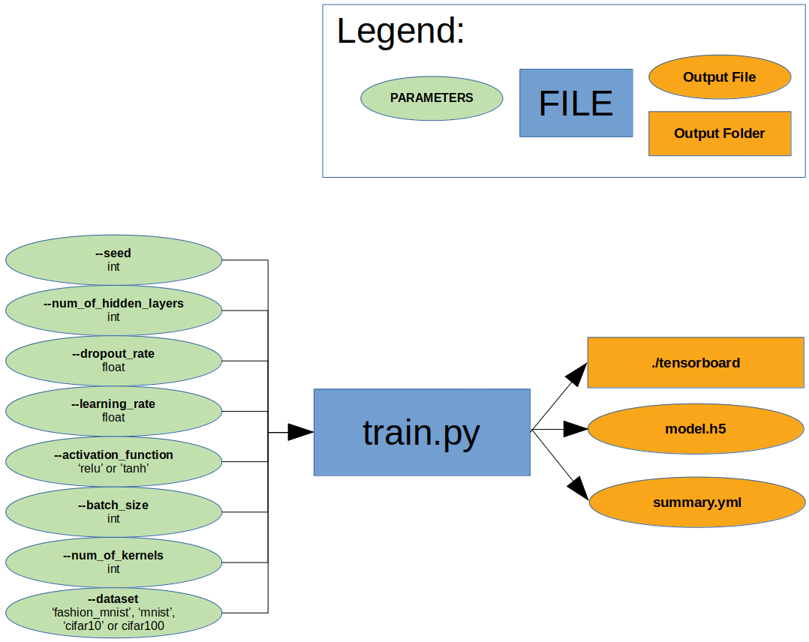

# Sorry
This tutorial is in work!




If we do not have any hyper parameter we can work easily with DVC and define the dependencies and output files of our
script. DVC will handle everything else:
```
dvc run --no-exec -d source/train.py \
                  -o tensorboard \
                  -o model.h5 \
                  -m summary.yml \
                  -f train.dvc \
                  "python source/train.py --seed 100 --num_of_hidden_layers 3 --num_of_kernels 128 --dropout_rate 0.1 --learning_rate 0.01 --activation_function relu --batch_size 512 --epochs 1000 --dataset mnist"
```